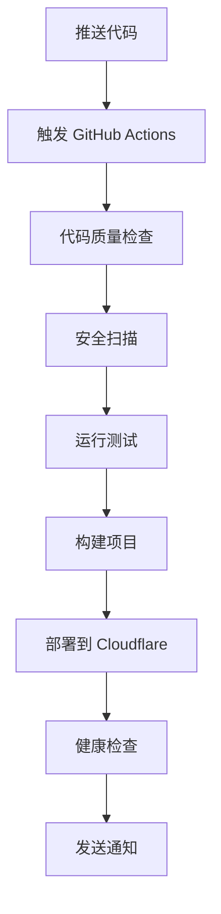

# 🤖 GitHub Actions 自动部署完整指南

本指南将帮助你快速设置 tgState 的 GitHub Actions 自动部署系统。

## 🚀 一键设置

### 方法 1: 使用自动化脚本（推荐）

```bash
# 克隆仓库
git clone https://github.com/csznet/tgState.git
cd tgState

# 运行自动化设置脚本
./scripts/setup-github-actions.sh
```

脚本会自动：
- ✅ 收集所需的配置信息
- ✅ 验证配置的正确性
- ✅ 设置 GitHub Secrets 和 Variables
- ✅ 创建本地开发环境文件
- ✅ 验证工作流配置

### 方法 2: 手动设置

如果你更喜欢手动设置，请按照以下步骤操作：

## 📋 必需的配置

### 1. GitHub Secrets 设置

在你的 GitHub 仓库中设置以下 Secrets：

**路径**: 仓库 → Settings → Secrets and variables → Actions → New repository secret

| Secret 名称 | 描述 | 获取方法 |
|------------|------|----------|
| `CLOUDFLARE_API_TOKEN` | Cloudflare API 令牌 | [获取步骤](#获取-cloudflare-api-token) |
| `CLOUDFLARE_ACCOUNT_ID` | Cloudflare 账户 ID | [获取步骤](#获取-cloudflare-account-id) |
| `TELEGRAM_BOT_TOKEN` | Telegram Bot 令牌 | [获取步骤](#创建-telegram-bot) |
| `TELEGRAM_TARGET` | 存储目标 | [设置步骤](#设置存储目标) |

### 2. GitHub Variables 设置

**路径**: 仓库 → Settings → Secrets and variables → Actions → Variables

| Variable 名称 | 描述 | 默认值 |
|--------------|------|--------|
| `RUN_MODE` | 运行模式 | `p` |
| `CUSTOM_DOMAIN` | 自定义域名 | 留空 |

### 3. 可选的 Secrets

| Secret 名称 | 描述 | 用途 |
|------------|------|------|
| `ACCESS_PASSWORD` | 访问密码 | 网站密码保护 |
| `SLACK_WEBHOOK_URL` | Slack 通知 | 部署通知 |
| `KV_NAMESPACE_ID` | KV 存储 ID | 缓存功能 |
| `CODECOV_TOKEN` | Codecov 令牌 | 代码覆盖率 |

## 🔧 详细配置步骤

### 获取 Cloudflare API Token

1. 登录 [Cloudflare Dashboard](https://dash.cloudflare.com/profile/api-tokens)
2. 点击 "Create Token"
3. 选择 "Edit Cloudflare Workers" 模板
4. 或者自定义权限：
   - **Account**: `Cloudflare Workers:Edit`
   - **Zone**: `Zone Settings:Read, Zone:Read` (如果使用自定义域名)
5. 点击 "Continue to summary" → "Create Token"
6. 复制生成的令牌

### 获取 Cloudflare Account ID

1. 在 Cloudflare Dashboard 右侧边栏找到 "Account ID"
2. 点击复制按钮

### 创建 Telegram Bot

1. 在 Telegram 中联系 [@BotFather](https://t.me/BotFather)
2. 发送 `/newbot` 命令
3. 按提示设置机器人名称和用户名
4. 获取 Bot Token（格式：`1234567890:ABC...`）

### 设置存储目标

选择以下方式之一：

**选项 A: 使用频道**
```bash
# 1. 创建 Telegram 频道
# 2. 将 Bot 添加为管理员
# 3. 使用频道用户名作为 TARGET
TELEGRAM_TARGET="@mychannel"
```

**选项 B: 使用群组**
```bash
# 1. 创建 Telegram 群组
# 2. 将 Bot 添加到群组
# 3. 使用群组用户名作为 TARGET
TELEGRAM_TARGET="@mygroup"
```

**选项 C: 使用个人账户**
```bash
# 1. 联系 @getmyid_bot 获取你的 ID
# 2. 使用数字 ID 作为 TARGET
TELEGRAM_TARGET="123456789"
```

## 🔄 工作流说明

### 自动触发的工作流

1. **代码推送到主分支** → 自动部署到生产环境
2. **创建 Pull Request** → 自动部署到开发环境
3. **推送 Git 标签** → 创建 Release 并部署
4. **定时任务** → 自动运行 CI 检查和清理

### 手动触发的工作流

- **手动部署**: Actions → Deploy to Cloudflare Workers → Run workflow
- **清理维护**: Actions → Cleanup & Maintenance → Run workflow

## 📊 监控和检查

### 使用状态检查脚本

```bash
# 检查生产环境状态
./scripts/check-deployment-status.sh production

# 检查开发环境状态
./scripts/check-deployment-status.sh development
```

### 手动检查命令

```bash
# 检查 GitHub Actions 状态
gh run list

# 检查 Cloudflare Workers
npx wrangler list

# 查看实时日志
npx wrangler tail

# 健康检查
curl https://your-domain.com/health
```

## 🎯 部署流程

### 标准部署流程



### 环境部署策略

- **开发环境**: 每个 PR 自动部署，用于测试和预览
- **生产环境**: 主分支推送时自动部署，用于正式服务

## 🔧 自定义配置

### 修改部署配置

编辑 `.github/workflows/deploy-cloudflare.yml`：

```yaml
# 修改 Node.js 版本
env:
  NODE_VERSION: '20'  # 改为你需要的版本

# 修改兼容性日期
compatibility_date: "2024-01-01"

# 添加环境变量
[vars]
CUSTOM_VAR = "your_value"
```

### 添加自定义域名

1. **在 Cloudflare 中配置域名**:
   - Workers & Pages → 你的 Worker → Settings → Triggers
   - 添加自定义域名

2. **更新 GitHub Variables**:
   ```bash
   # 使用 GitHub CLI
   gh variable set CUSTOM_DOMAIN --body "https://your-domain.com"
   
   # 或在 GitHub 网页界面设置
   ```

### 配置通知

#### Slack 通知

1. 创建 Slack Incoming Webhook
2. 设置 `SLACK_WEBHOOK_URL` Secret
3. 系统会自动发送部署通知

#### 邮件通知

GitHub Actions 默认会向仓库管理员发送失败通知。

## 🐛 故障排除

### 常见问题及解决方案

#### 1. 部署失败：Authentication error

**原因**: Cloudflare API Token 无效或权限不足

**解决方案**:
```bash
# 验证 API Token
npx wrangler whoami

# 重新生成 API Token 并更新 Secret
```

#### 2. 健康检查失败

**原因**: Worker 启动失败或环境变量错误

**解决方案**:
```bash
# 查看 Worker 日志
npx wrangler tail

# 检查环境变量
./scripts/check-deployment-status.sh
```

#### 3. Telegram Bot 无法发送消息

**原因**: Bot 未添加到目标频道或权限不足

**解决方案**:
1. 确认 Bot 已添加到目标频道/群组
2. 确认 Bot 具有发送消息权限
3. 验证 TARGET 格式正确

#### 4. 工作流权限错误

**原因**: GitHub Actions 权限不足

**解决方案**:
1. 仓库 → Settings → Actions → General
2. 设置 "Workflow permissions" 为 "Read and write permissions"

### 调试技巧

```bash
# 1. 检查工作流语法
gh workflow view

# 2. 查看详细日志
gh run view --log

# 3. 本地测试部署
npm run deploy

# 4. 验证配置
npx wrangler validate

# 5. 测试 Telegram 连接
curl -X POST "https://api.telegram.org/bot$TOKEN/getMe"
```

## 📚 相关资源

### 官方文档
- [GitHub Actions 文档](https://docs.github.com/en/actions)
- [Cloudflare Workers 文档](https://developers.cloudflare.com/workers/)
- [Wrangler CLI 文档](https://developers.cloudflare.com/workers/wrangler/)

### 工具和服务
- [GitHub CLI](https://cli.github.com/) - 命令行管理 GitHub
- [Cloudflare Dashboard](https://dash.cloudflare.com/) - 管理 Workers
- [Telegram BotFather](https://t.me/BotFather) - 创建和管理 Bot

### 社区支持
- [GitHub Issues](https://github.com/csznet/tgState/issues) - 问题反馈
- [Telegram 群组](https://t.me/tgstate123) - 社区讨论

## 🎉 完成设置

设置完成后，你的部署流程将完全自动化：

1. **开发**: 创建 PR → 自动部署到开发环境 → 测试
2. **发布**: 合并 PR → 自动部署到生产环境 → 上线
3. **监控**: 自动健康检查 → 错误通知 → 及时响应

享受自动化部署带来的便利！🚀